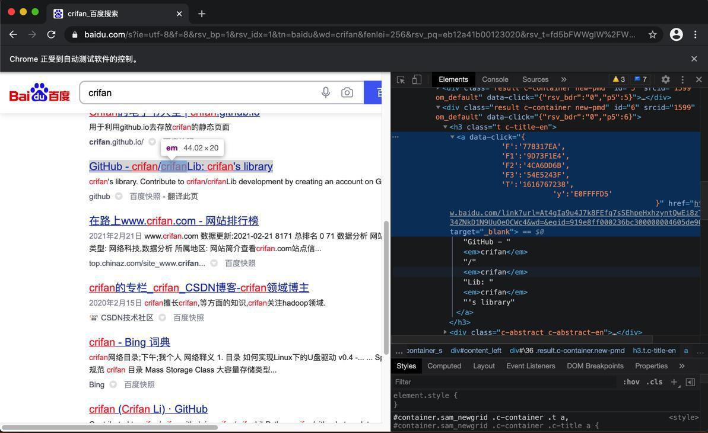

# 获取元素属性

获取元素属性的典型用法，比如：

* a元素
  * 获取a的href链接
    * `aElement.get_attribute("href")`
  * 获取a的文本值
    * `aElement.text`

## 举例：解析提取百度搜索结果

对于页面：



的html是：

```html
<h3 class="t c-title-en"><a data-click="{
    'F':'778317EA',
    'F1':'9D73F1E4',
    'F2':'4CA6DD6B',
    'F3':'54E5243F',
    'T':'1616767238',
        'y':'E0FFFFD5'
            }" href="https://www.baidu.com/link?url=At4gIa9u4J7k8FEfq7sSEhpeHxhzyntQwEi8zTkeWpSbv_34ZNkD1N9UuQeOCWc4&wd=&eqid=919e8ff000236bc300000004605de906" target="_blank">GitHub - <em>crifan</em>/<em>crifan</em>Lib: <em>crifan</em>'s library</a></h3>

```

已经通过代码：

```python
searchResultAList = chromeDriver.find_elements_by_xpath("//h3[contains(@class, 't')]/a")
```

然后就可以用`htmlElement.get_attribute("href")`去获取`href`的url链接：

```python
for curIdx, curSearchResultAElem in enumerate(searchResultAList):
  print("%s [%d] %s" % ("-"*20, curIdx, "-"*20))
  aHref = curSearchResultAElem.get_attribute("href")
  print("aHref=%s" % aHref)
```

类似的，想要获取文本值，用`text`：

```python
  aText = curSearchResultAElem.text
  print("aText=%s" % aText)
```

此处输出：

```bash
-------------------- [0] --------------------
aHref=http://www.baidu.com/link?url=LMF5vQH-QgOuEhaq5huV3bLHlwVSDbVwv2g6vUYJ9AjmaCyIWKuL8f1YR5uOGzUc
aText=在路上on the way - 走别人没走过的路,让别人有路可走
-------------------- [1] --------------------
aHref=http://www.baidu.com/link?url=n4QoZVrJ5gncFIpJZhRcdmoA-oEmVewHEriXaLesj_wuypw3ZGebZ8sgC56-3ueD
aText=crifan – 在路上
...
```

## 特殊：对于html的解析，一般更常用专用的库：`BeautifulSoup`

对于html的解析，元素的获取等操作，往往会换专用的html解析库：`BeautifulSoup`

举例，此处对应代码：

```python
# Method 2: use BeautifulSoup to extract title list
curHtml = chromeDriver.page_source
curSoup = BeautifulSoup(curHtml, 'html.parser')
beginTP = re.compile("^t.*")
searchResultH3List = curSoup.find_all("h3", {"class": beginTP})
print("searchResultH3List=%s" % searchResultH3List)
for curIdx, searchResultH3Item in enumerate(searchResultH3List):
  print("%s [%d] %s" % ("-"*20, curIdx, "-"*20))
  aElem = searchResultH3Item.find("a")
  # print("aElem=%s" % aElem)
  baiduLinkUrl = aElem.attrs["href"]
  print("baiduLinkUrl=%s" % baiduLinkUrl)
  title = aElem.text
  print("title=%s" % title)
```

调试效果：


最终，同样的输出：

```bash
-------------------- [0] --------------------
baiduLinkUrl=http://www.baidu.com/link?url=DVUbOETLyMZLC5c_V7RJReScFExnTjXjyTsO_QO_0rOL0vSE4mMNIPaZLH7iIaHI
title=在路上on the way - 走别人没走过的路,让别人有路可走
-------------------- [1] --------------------
baiduLinkUrl=http://www.baidu.com/link?url=xA8mzlRBwfRb_I-PgUMj9_COWGmdEr-GcNo-DlxCqYzTKYsjqpLrmQImHO5X41Qy
title=crifan – 在路上
...
```
