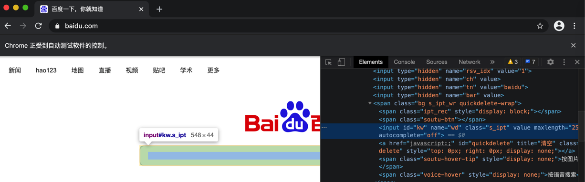

# 查找定位元素

`查找元素`=`定位元素`

举例：

对于页面：



的html是：

```html
<input id="kw" name="wd" class="s_ipt" value="" maxlength="255" autocomplete="off">
```

对应查找该元素的典型方式是：

* `find_element_by_id(id_)`
  * 代码
    ```python
    driver.find_element_by_id("kw")
    ```
  * 输出
    ```bash
    <selenium.webdriver.remote.webelement.WebElement (session="5fb657d67aa9c8060f2d0b407b4d40df", element="a879125d-ebb4-4e0f-9659-9c3b07087bac")>
    ```
  * 文档
    * [4.1. Locating by Id](https://selenium-python.readthedocs.io/locating-elements.html#locating-by-id)
    * [`find_element_by_id(id_)`](https://selenium-python.readthedocs.io/api.html#selenium.webdriver.remote.webdriver.WebDriver.find_element_by_id)
  * 注意：确保此处的id是唯一的
* `find_element(by='id', value=None)`
  * 代码
    ```python
    driver.find_element(by="kw")
    ```
  * 文档
    * [`find_element(by='id', value=None)`](https://selenium-python.readthedocs.io/api.html#selenium.webdriver.remote.webdriver.WebDriver.find_element)

### 查找元素的更详细介绍

去Selenium中定位和查找元素：

方法有很多，常见的有：

* `find_element_by_id`
* `find_element_by_name`
* `find_element_by_xpath`
* `find_element_by_link_text`
* `find_element_by_partial_link_text`
* `find_element_by_tag_name`
* `find_element_by_class_name`
* `find_element_by_css_selector`

如果页面中有多个该元素，则可以用：

* `find_elements_by_name`
* `find_elements_by_xpath`
* `find_elements_by_link_text`
* `find_elements_by_partial_link_text`
* `find_elements_by_tag_name`
* `find_elements_by_class_name`
* `find_elements_by_css_selector`

* 官网文档
  * 中文
    * [4. 查找元素 — Selenium-Python中文文档 2 documentation](https://selenium-python-zh.readthedocs.io/en/latest/locating-elements.html)
  * 英文
    * [4. Locating Elements — Selenium Python Bindings 2 documentation](https://selenium-python.readthedocs.io/locating-elements.html)
