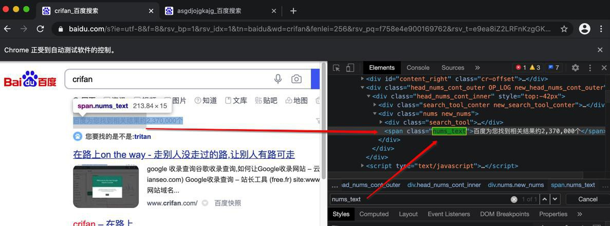

# 等待元素出现

很多时候，会遇到类似问题：

查找元素，点击触发搜索类的操作后，页面刷新后，继续去寻找搜索结果元素，调试时代码逻辑没问题，但直接运行却找不到搜索结果

这时候，往往是由于：没有等待搜索完毕

而典型的解决办法是，去研究搜索结果完毕后，肯定会显示的某些元素。然后去判断和等待该元素是否出现

* 该元素显示了：说明搜索结果完成了
* 该元素还没显示：说明搜索结果还没完成，需要继续等待

对于**等待元素出现**的操作，`Selenium`中有专门的函数实现这个逻辑。

## 举例：等待百度搜索结果完成后的某元素出现

对于百度页面搜索结果，完成时，必然会出现的一个元素是：

* 

对应html：

```html
<span class="nums_text">百度为您找到相关结果约2,370,000个</span>
```

**等待该元素出现**的对应代码是：

```python
from selenium.webdriver.support.ui import WebDriverWait
from selenium.webdriver.common.by import By
from selenium.webdriver.support import expected_conditions as EC

MaxWaitSeconds = 10
numTextElem = WebDriverWait(chromeDriver, MaxWaitSeconds).until(
    EC.presence_of_element_located((By.XPATH, "//span[@class='nums_text']"))
)
print("Search complete, showing: %s" % numTextElem)
```

## 举例：等待bing必应搜索结果完成后的某元素出现

对于bing必应搜索结果完成后，必然会出现的一个元素是：


html:

```html
<span class="sb_count">9,120,000 条结果</span>
```

**等待该元素出现**的对应代码是：

```python
# wait bing search complete -> show some element
# <span class="sb_count">9,120,000 条结果</span>
MaxWaitSeconds = 10
searchCountElem = WebDriverWait(driver, MaxWaitSeconds).until(
    EC.presence_of_element_located((By.XPATH, "//span[@class='sb_count']"))
)
```
