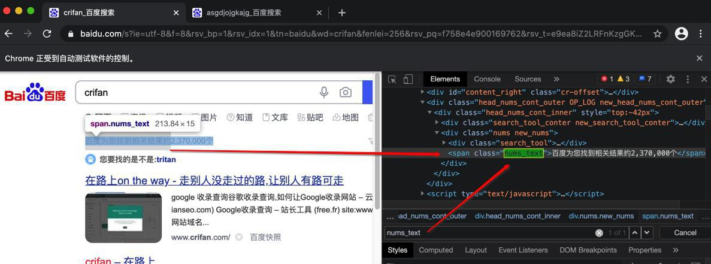

# 模拟百度搜索

此处用Selenium，模拟百度搜索，并提取第一页搜索结果的信息。

## 代码

* 文件下载：[seleniumDemoBaiduSearch.py](../assets/file/baiduSearchAutomation/selenium/seleniumDemoBaiduSearch.py)
* 直接贴出源码

```python
# Function: demo selenium do baidu search and extract result
# Author: Crifan Li
# Update: 20210327

from selenium import webdriver
from selenium.webdriver.common.keys import Keys
from selenium.webdriver.common.by import By
from selenium.webdriver.support.ui import WebDriverWait
from selenium.webdriver.support import expected_conditions as EC

from bs4 import BeautifulSoup
import re

chromeDriver = webdriver.Chrome()

################################################################################
# Open url
################################################################################
baiduUrl = "https://www.baidu.com"
chromeDriver.get(baiduUrl)
print("title=%s" % chromeDriver.title)

assert chromeDriver.title == "百度一下，你就知道"
# assert '百度' in chromeDriver.title

################################################################################
# Find/Locate search button
################################################################################
SearchButtonId = "kw"
searchButtonElem = chromeDriver.find_element_by_id(SearchButtonId)
print("searchButtonElem=%s" % searchButtonElem)
# searchButtonElem=<selenium.webdriver.remote.webelement.WebElement (session="e0d8b72f2fc31e27220f66fcbdb22bfc", element="21aa0e9d-04fa-4385-b16b-d82998068887")>

################################################################################
# Input text
################################################################################
searchButtonElem.clear()
print("Clear existed content")

searchStr = "crifan"
searchButtonElem.send_keys(searchStr)
print("Entered %s to search box" % searchStr)

################################################################################
# Click button
################################################################################

# Method 1: emulate press Enter key
# searchButtonElem.send_keys(Keys.RETURN)
# print("Pressed Enter/Return key")

# Method 2: find button and click
BaiduSearchId = "su"
baiduSearchButtonElem = chromeDriver.find_element_by_id(BaiduSearchId)
print("baiduSearchButtonElem=%s" % baiduSearchButtonElem)
baiduSearchButtonElem.click()
print("Clicked button %s" % baiduSearchButtonElem)

################################################################################
# Wait page change/loading completed
#   -> following element makesure show = visible
#   -> otherwise possibly can NOT find elements
################################################################################
MaxWaitSeconds = 10
numTextElem = WebDriverWait(chromeDriver, MaxWaitSeconds).until(
    EC.presence_of_element_located((By.XPATH, "//span[@class='nums_text']"))
)
print("Search complete, showing: %s" % numTextElem)

################################################################################
# Extract result
################################################################################

# Method 1: use Selenium to extract title list
searchResultAList = chromeDriver.find_elements_by_xpath("//h3[contains(@class, 't')]/a")
print("searchResultAList=%s" % searchResultAList)
searchResultANum = len(searchResultAList)
print("searchResultANum=%s" % searchResultANum)
for curIdx, curSearchResultAElem in enumerate(searchResultAList):
  curNum = curIdx + 1
  print("%s [%d] %s" % ("-"*20, curNum, "-"*20))
  baiduLinkUrl = curSearchResultAElem.get_attribute("href")
  print("baiduLinkUrl=%s" % baiduLinkUrl)
  title = curSearchResultAElem.text
  print("title=%s" % title)

# # Method 2: use BeautifulSoup to extract title list
# curHtml = chromeDriver.page_source
# curSoup = BeautifulSoup(curHtml, 'html.parser')
# beginTP = re.compile("^t.*")
# searchResultH3List = curSoup.find_all("h3", {"class": beginTP})
# print("searchResultH3List=%s" % searchResultH3List)
# searchResultH3Num = len(searchResultH3List)
# print("searchResultH3Num=%s" % searchResultH3Num)
# for curIdx, searchResultH3Item in enumerate(searchResultH3List):
#   curNum = curIdx + 1
#   print("%s [%d] %s" % ("-"*20, curNum, "-"*20))
#   aElem = searchResultH3Item.find("a")
#   # print("aElem=%s" % aElem)
#   baiduLinkUrl = aElem.attrs["href"]
#   print("baiduLinkUrl=%s" % baiduLinkUrl)
#   title = aElem.text
#   print("title=%s" % title)

################################################################################
# End close
################################################################################
chromeDriver.close()
```

## 视频

<video id="seleniumDemoBaiduSearch" controls="controls" preload="none" width="800" height="600">
  <source src="../assets/file/baiduSearchAutomation/selenium/seleniumDemoBaiduSearch.mp4" type="video/mp4">
</video>

## 相关图片

* 打开百度首页
  * 
* 调试输入框的html
  * 
* 输入框中可以输入搜索关键字：crifan
  * 
* 研究搜索结果中必然出现的字段
  * 
* 调试搜索结果每一项的html
  * 
* 点击触发搜索是可以的
  * 
* 最终解析出百度搜索结果
  * 
