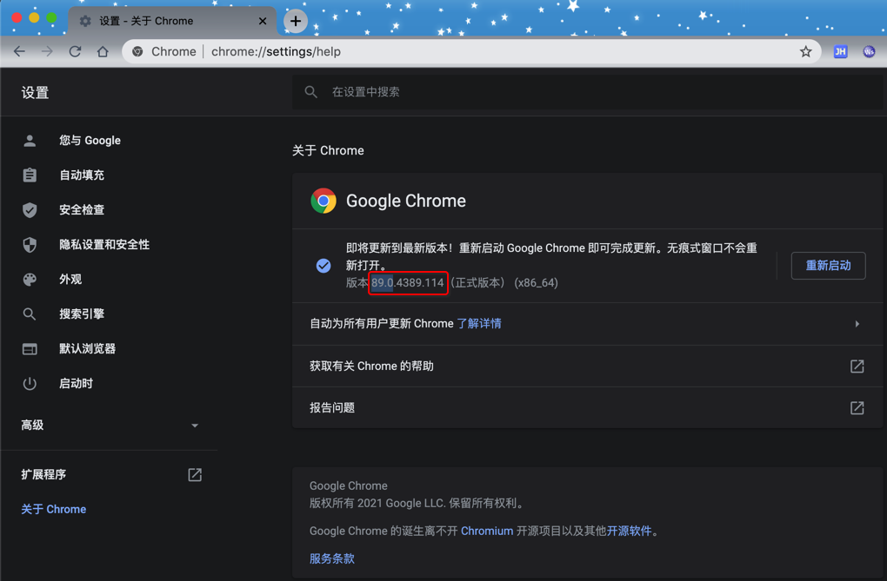
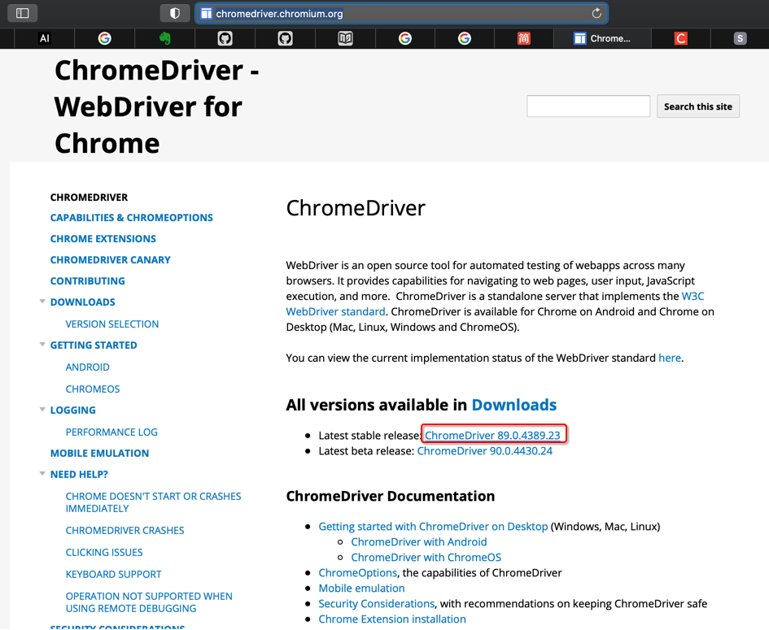
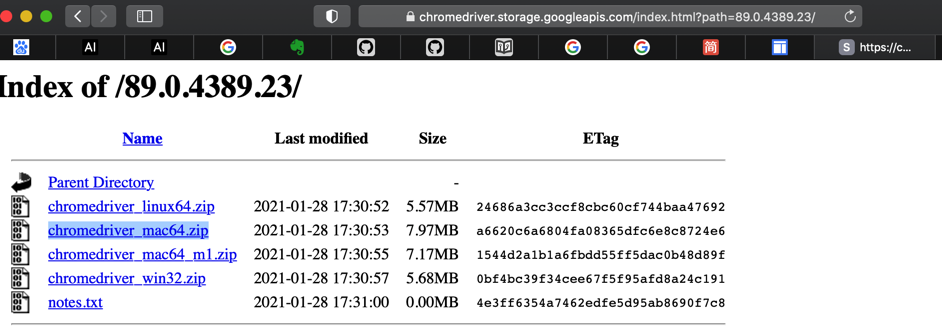
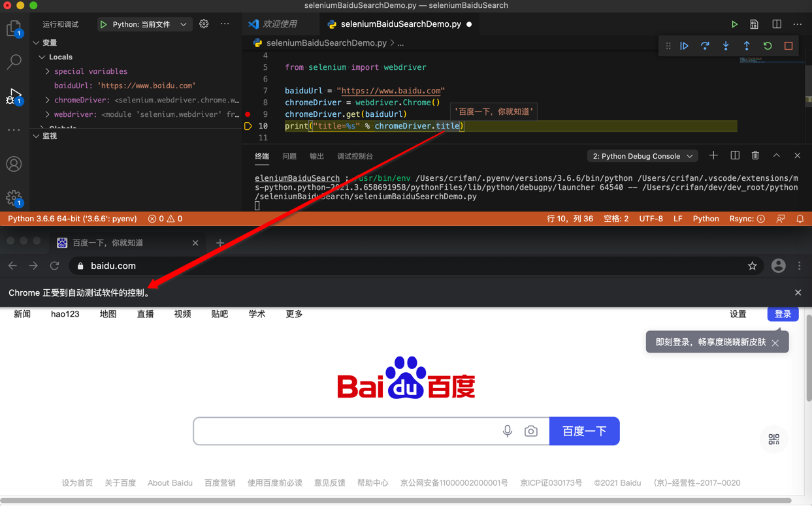

# 初始化

核心逻辑：

* Python中安装Selenium库
  * `pip install selenium`
* 再安装webdriver
  * 比如：`Chrome`的`driver`：`chromedriver`
    * 需要下载到二进制的chromedriver，并确保PATH中能找到

## 安装`selenium`

```bash
pip3 install selenium
```

附上完整log

```bash
 pip3 install selenium       
Looking in indexes: http://mirrors.aliyun.com/pypi/simple/
Collecting selenium
  Downloading http://mirrors.aliyun.com/pypi/packages/80/d6/4294f0b4bce4de0abf13e17190289f9d0613b0a44e5dd6a7f5ca98459853/selenium-3.141.0-py2.py3-none-any.whl (904 kB)
     |████████████████████████████████| 904 kB 1.2 MB/s
Requirement already satisfied: urllib3 in /Users/crifan/.pyenv/versions/3.6.6/lib/python3.6/site-packages (from selenium) (1.25.8)
Installing collected packages: selenium
Successfully installed selenium-3.141.0
```

## 安装driver

`Selenium`的运行依赖于具体的浏览器（的内核），此处叫做：`driver`

* `Chrome`的`driver`：`ChromeDriver` = `chromedriver`

### 安装Chrome的driver：`ChromeDriver`

#### 下载`ChromeDriver`

> #### warning:: 要下载和你的Chrome版本一致的`ChromeDriver`
> 
> 此处查看到Chrome的版本是: `89.0`
> 
> 
> 
> 所以要下载的`ChromeDriver`也是要于此版本一致的，即下载`ChromeDriver 89.0`的版本

* 下载源1：**Chrome官网**
  * [ChromeDriver - WebDriver for Chrome](http://chromedriver.chromium.org)
    * 此时最新版是：`ChromeDriver 89.0.4389.23`
      * 
  * [Index of /89.0.4389.23/](https://chromedriver.storage.googleapis.com/index.html?path=89.0.4389.23/)
  * [chromedriver_mac64.zip](https://chromedriver.storage.googleapis.com/89.0.4389.23/chromedriver_mac64.zip)
    * 
* 下载源2：**淘宝的npm源**
  * http://npm.taobao.org/mirrors/chromedriver/
  * ->
  * http://npm.taobao.org/mirrors/chromedriver/89.0.4389.23/
  * ->
  * http://npm.taobao.org/mirrors/chromedriver/89.0.4389.23/chromedriver_mac64.zip

#### 确保命令行中能调用到chromedriver

想要让命令行中，可以调用到`chromedriver`，即：把`chromedriver`放到环境变量`PATH`中：

下载后解压得到二进制的：`chromedriver`

把`chromedriver`放到`PATH`中

* 方式1：移动到系统相关目录
  ```bash
  sudo mv /xxx/chromedriver /usr/local/bin
  ```
* 方式2：放到某个路径下，把该路径加到PATH中
  * 此处放到了：`/Users/crifan/dev/dev_tool/selenium/chromedriver`
  * 把路径加到PATH中
    * 编辑启动脚本：
      ```bash
      vi ~/.zshrc
      ```
      * 在文件最后加上：`PATH=$PATH:/Users/crifan/dev/dev_tool/selenium`
    * 使其立刻生效：
      ```bash
      source ~/.zshrc
      ```

然后去确认命令行中能找到：

```bash
which chromedriver
```

确保能输出对应了路径，表示找到了。

顺带也可以去：看看版本：

```bash
chromedriver --version
```

此处输出是：`ChromeDriver 89.0.4389.23`

## 写测试代码，确认环境正常

可以用代码：

```python
from selenium import webdriver

baiduUrl = "https://www.baidu.com"
chromeDriver = webdriver.Chrome()
chromeDriver.get(baiduUrl)
print("title=%s" % chromeDriver.title)
```

确认Selenium是否正常工作：可以启动Chrome浏览器，打开百度首页。

正常的效果：



其中可以注意到：`Selenium`操作的`Chrome`会有提示：`Chrome正受到自动测试软件的控制`
