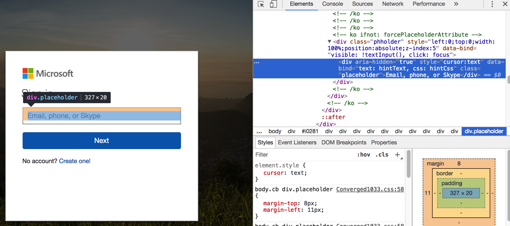
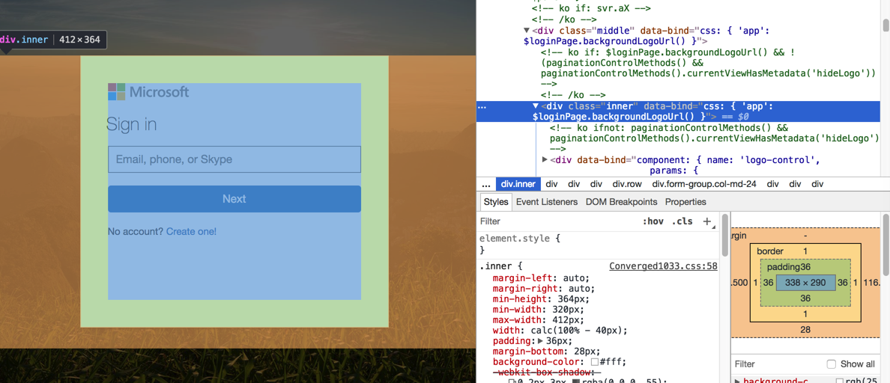

# Selenium心得和总结

## WebElement有很多函数和属性
整理如下，供有个概念：

* 函数
    * `clear()`
    * `click()`
    * `find_element(by='id', value=None)`
    * `find_element_by_class_name(name)`
    * `find_element_by_css_selector(css_selector)`
    * `find_element_by_id(id_)`
    * `find_element_by_link_text(link_text)`
    * `find_element_by_name(name)`
    * `find_element_by_partial_link_text(link_text)`
    * `find_element_by_tag_name(name)`
    * `find_element_by_xpath(xpath)`
    * `find_elements(by='id', value=None)`
    * `find_elements_by_class_name(name)`
    * `find_elements_by_css_selector(css_selector)`
    * `find_elements_by_id(id_)`
    * `find_elements_by_link_text(link_text)`
    * `find_elements_by_name(name)`
    * `find_elements_by_partial_link_text(link_text)`
    * `find_elements_by_tag_name(name)`
    * `find_elements_by_xpath(xpath)`
    * `get_attribute(name)`
    * `get_property(name)`
    * `is_displayed()`
    * `is_enabled()`
    * `is_selected()`
    * `screenshot(filename)`
    * `send_keys(*value)`
    * `submit()`
    * `value_of_css_property(property_name)`
* 属性
    * `id`
    * `location`
    * `parent`
    * `rect`
    * `screenshot_as_png`
    * `size`
    * `text`
    * `tag_name`

更多内容详见官网文档：[WebElement](http://selenium-python.readthedocs.io/api.html#module-selenium.webdriver.remote.webelement)

其中：
* `find_element_by_link_text`
* `find_element_by_partial_link_text`
指的是标签`a`的`link`，而其他标签是用不了的。

## 不是`select`和`option`的下拉选项列表

`select`只能用于
```html
<select>
    <option>
```
才可以。其他的元素，比如我遇到的：
[【已解决】Selenium如何点击下拉框并选择某个值](http://www.crifan.com/selenium_click_dropdown_show_option_list_to_choose_someone)
中的
```html
<ul>
    <li role="option">
```
是用不了的。

所以最后就是用普通的，去`ul`下找到`li`的列表，通过index获得对应的元素，然后再去操作。

相关代码如下：
```python
cartNumOptionElemList = driver.find_elements_by_xpath('//ul[@class="dropdown-menu"]/li[@role="option"]')
cartNumOptionCount = len(cartNumOptionElemList)
logging.info("cartNumOptionElemList=%s,cartNumOptionCount=%s", cartNumOptionElemList, cartNumOptionCount)
if cartNumOptionCount < gCfg["msStore"]["onceBuyNum"]:
    logging.error("Current Cart select max number %s < expected select number %s", cartNumOptionCount, gCfg["msStore"]["onceBuyNum"])
    driver.quit()
toSelectIdx = gCfg["msStore"]["onceBuyNum"] - 1
# carNumSelect = Select(cartNumOptionElemList)
# carNumSelect.select_by_index(gCfg["msStore"]["onceBuyNum"])
carNumSelectElem = cartNumOptionElemList[toSelectIdx]
logging.info("carNumSelectElem=%s", carNumSelectElem)
carNumSelectElem.click()
# aLinkElem = carNumSelectElem.find_element_by_link_text(str(gCfg["msStore"]["onceBuyNum"]))
# logging.info("aLinkElem=%s", aLinkElem)
# aLinkElem.click()
```

## 有时候Chrome中直接右键找到的元素，并不一定是你想要的
比如：


是个：
```html
<div class="placeholder">
```

但是其实此处要找的是 **可以允许输入的input输入框**

而后来是无意间自己调试，从中间的区域，右键后：


然后一点点点击看子元素：



最后找到真正的input的：


```html
<input type="email" name="loginfmt" id="i0116" ......
                    attr: inputAttributes" aria-label="Enter your email, phone, or Skype.">
```

## 有时候点击按钮后页面刷新了，url地址也换了，再去用driver寻找元素之前，要先refresh后，才能找到

但是有时候却又不需要refresh也可以

最后是：
```python
driver.refresh()
inputEmailElement = driver.find_element_by_xpath('//div[@class="placeholderContainer"]/input[@name="loginfmt"]’)
```
或：
```python
inputEmailElement = WebDriverWait(driver, 10).until(
    EC.presence_of_element_located((By.XPATH, '//div[@class="placeholderContainer"]/input[@name="loginfmt"]')))
```
好像都可以。

注：

不过还是不知道为何前面的代码：
```python
placeholderElement = driver.find_element_by_xpath('//div[@class="phholder"]/div[@class="placeholder"]')
placeholderElement = WebDriverWait(driver, 10).until(
    EC.presence_of_element_located((By.XPATH, '//div[@class="phholder"]/div[@class="placeholder"]')))
placeholderElement = driver.find_element_by_xpath('//div[@class="phholder"]')
phholderElement = driver.find_element_by_class_name('phholder')
logging.info("phholderElement=%s", phholderElement)
placeholderElement = phholderElement.find_element_by_class_name("placeholder")
```
确保xpath写的是对的，查看页面元素是存在的，但却还是找不到元素。


## 单个WebElement本身好像不支持截图
详见：
[WebElement.screenshot(filename)](http://selenium-python.readthedocs.io/api.html#selenium.webdriver.remote.webelement.WebElement.screenshot)
和：
[WebElement.screenshot_as_png](http://selenium-python.readthedocs.io/api.html#selenium.webdriver.remote.webelement.WebElement.screenshot_as_png)

以为单个WebElement也不支持截图，但是试了试：
```python
multipleXpathRule = '//div/......'
priceSpanElement = driver.find_element_by_xpath(multipleXpathRule)
priceSpanElement.screenshot("priceElement.png")
```

结果报错：
`selenium.common.exceptions.WebDriverException: Message: unknown command: session/7160497aa2d4dc2029bcb5c4d2e8045a/element/0.07853595638566757-1/screenshot`

所以算了。不去管这个了。感觉是**单个WebElement本身好像不支持截图**

## get的url没法back或forward，而navigate的url可以
详见：
[URL Loading in Selenium Webdriver: All about get() and navigate() – Make Selenium Easy](http://makeseleniumeasy.com/2017/05/04/url-loading-in-selenium-webdriver-all-about-get-and-navigate/)
