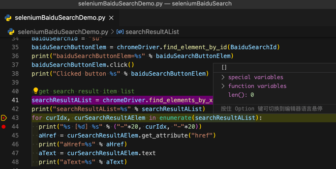
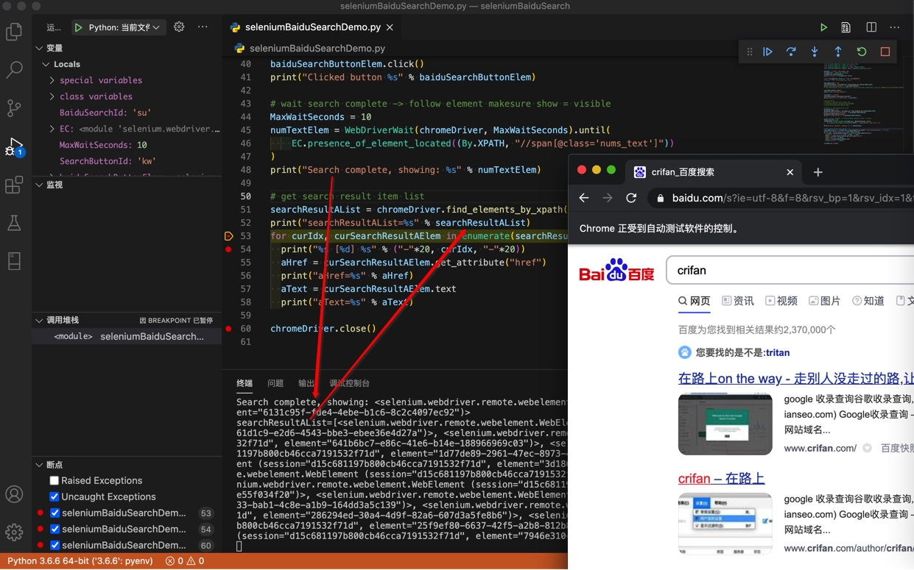

# 代码运行时却找不到元素

**现象**：查找元素的代码

```python
searchResultAList = chromeDriver.find_elements_by_xpath("//h3[contains(@class, 't')]/a")
```

调试时可以找到元素。

但是直接运行代码，却找不到元素，返回是空：



**原因**：（网页）页面元素重新加载了，比如百度搜索导致页面重新加载，显示搜索结果内容，但是此时代码运行时，搜索结果还没加载出来，导致搜不到。

而调试时，由于有足够的暂停的时间，使得页面已加载新的搜索结果内容，所以再继续调试，可以搜索到。

**解决办法**：加上等待机制：等待页面加载完毕。

而判断页面加载完毕，则是需要具体问题具体分析。

核心逻辑是：找到加载后的页面中，必然会出现的元素，作为判断的依据，判断该元素可见，则视为页面的确已加载完毕。

**操作步骤**：

此处经过调试，百度搜索结果中一定会出现：

**百度为您找到相关结果约 xxx**


对应的html是：

```html
<span class="nums_text">百度为您找到相关结果约2,370,000个</span>
```

对应的，等待一段时间，确保该元素出现的代码是：

```python
# wait search complete -> follow element makesure show = visible
MaxWaitSeconds = 10
numTextElem = WebDriverWait(chromeDriver, MaxWaitSeconds).until(
    EC.presence_of_element_located((By.XPATH, "//span[@class='nums_text']"))
)
print("Search complete, showing: %s" % numTextElem)
```

即可解决问题。

后续代码可以找到元素了：


