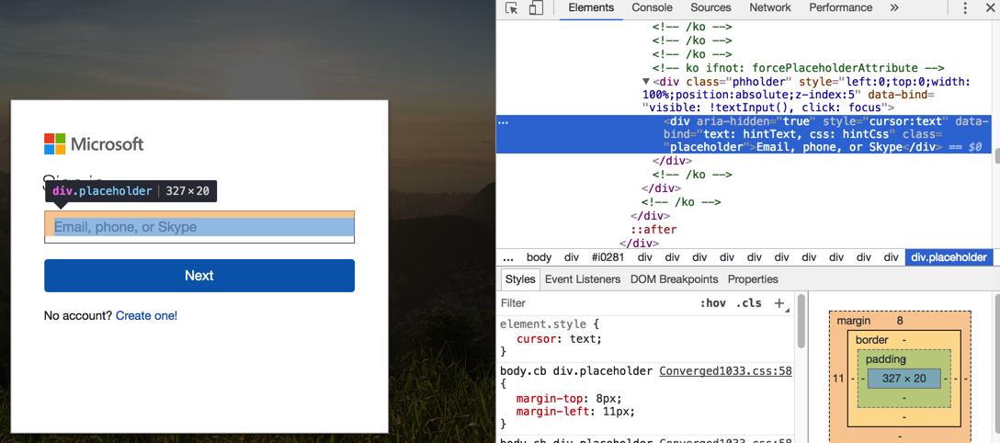
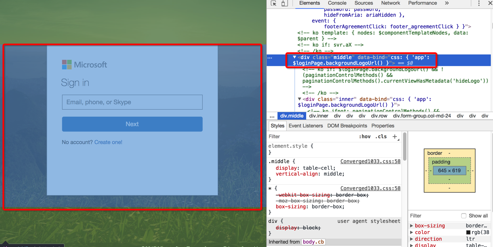
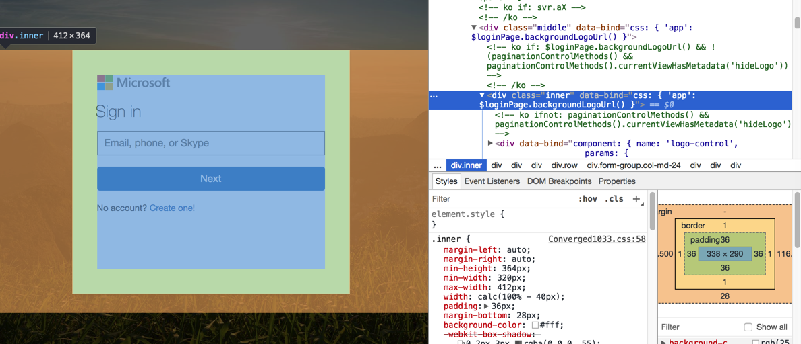
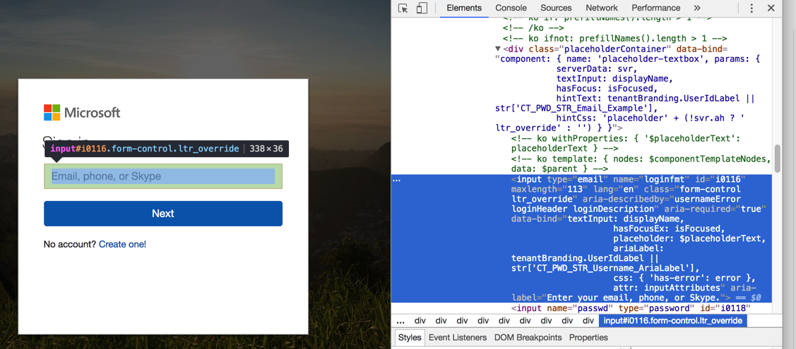

# 偶尔Chrome右键元素不是你要的

即：有时候Chrome中直接右键找到的元素，并不一定是你想要的

比如：



是个：

```html
<div class="placeholder">
```

但是其实此处要找的是 **可以允许输入的input输入框**

而后来是无意间自己调试，从中间的区域，右键后：



然后一点点点击看子元素：



最后找到真正的input的：



相关代码是：

```html
<input type="email" name="loginfmt" id="i0116" ......
                attr: inputAttributes" aria-label="Enter your email, phone, or Skype.">
```
